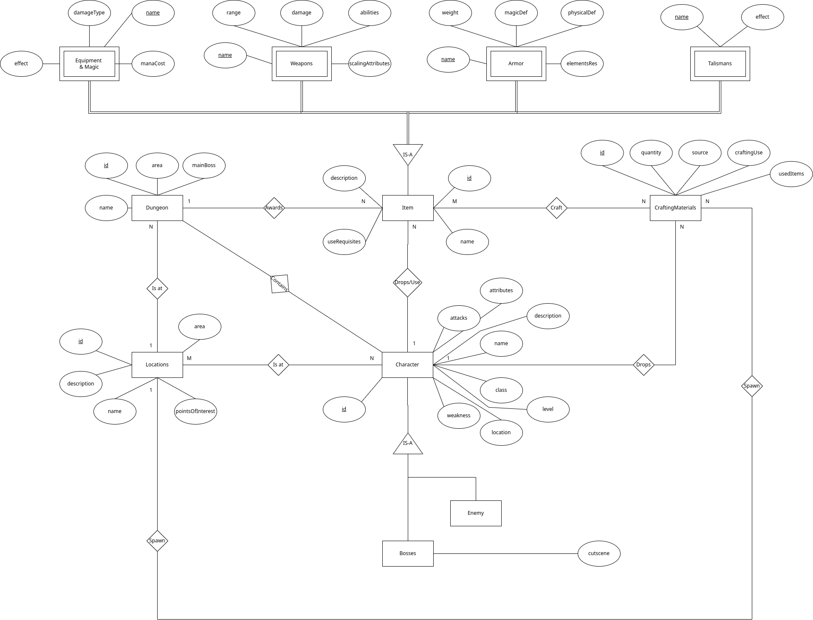

# Analise de requisitos

- Character está presente em várias localidades
- Um Character larga vários items
- Todos os Bosses são Characters
- Materias aparecem em várias localidades
- Uma localidade tem várias masmorras 
- Items podem ser encontrados em masmorras
- Os items podem ser Magias/Armas/Armaduras/Talismãs
- Masmorras contêm Characters
- Materiais são usados para construir items

# DER

# ER

